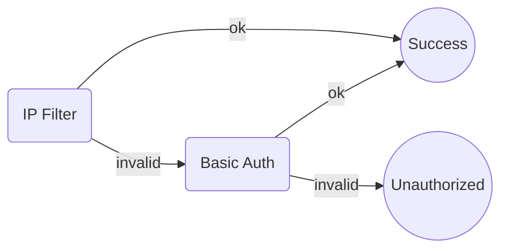

express-simple-access-control
---

This is a library for restricting access to applications implemented in express.

## Supported Restriction Methods

- Basic Authentication
- IP Filter

## Usage

### Basic Authentication

An example of Basic Authentication is as follows.

```typescript
import express from "express";
import useAccessControlMiddleware, {Option} from "express-simple-access-control";

const app = express();

// apply access restrictions
useAccessControlMiddleware(app, {
    basicAuthOption: {
        users: [
            {username: 'username', password: 'password'},
        ],
    },
} as Option);

// ...
```

### IP Filter

An example of IP Filter is as follows.

```typescript
import express from "express";
import useAccessControlMiddleware, {Option} from "express-simple-access-control";

const app = express();

// apply access restrictions
useAccessControlMiddleware(app, {
    ipFilterOption: {
        allowsIPs: ['XXX.XXX.XXX.XXX'],
        errStatusCode: 404,
        errMessage: 'Not Found',
    },
} as Option);

// ...
```

### Combination of IP Filter and Basic Authentication

An example combination of IP Filter and Basic Authentication is as follows.

```typescript
import express from "express";
import useAccessControlMiddleware, {Option} from "express-simple-access-control";

const app = express();

// apply access restrictions
useAccessControlMiddleware(app, {
    basicAuthOption: {
        users: [
            {username: 'username', password: 'password'},
        ],
    },
    ipFilterOption: {
        allowsIPs: ['XXX.XXX.XXX.XXX'],
        errStatusCode: 404,
        errMessage: 'Not Found',
    },
} as Option);

// ...
```

In this case, if client IP is allowed, it is considered accessible, and if not allowed, it is shifted to Basic authentication.



## Options

### Basic Authentication

|field name|default|description|
|----------|-------|-----------|
|users     |       |List of objects with Basic authentication username and password.|

### IP Filter

|field name   |default     |description|
|-------------|------------|-----------|
|allowIPs     |            |List of accessible IP addresses.|
|errStatusCode|401         |Response status when an access is received from an IP address not included in allowIPs.|
|errMessage   |Unauthorized|Response message when an access is received from an IP address not included in allowIPs.|

## How to get an IP address

Attempt to obtain an IP address in the following order.

1. `x-client-ip` in header
2. `x-forwarded-for` in header
3. `cf-connecting-ip` in header
4. `fastly-client-ip` in header
5. `true-client-ip` in header
6. `x-real-ip` in header
7. `x-cluster-client-ip` in header
8. `x-forwarded` in header
9. `forwarded-for` in header
10. `forwarded` in header
11. `remoteAddress` in socket

## License

The scripts and documentation in this repository are released under the [MIT License](https://github.com/hyorimitsu/express-simple-access-control/blob/main/LICENSE).
